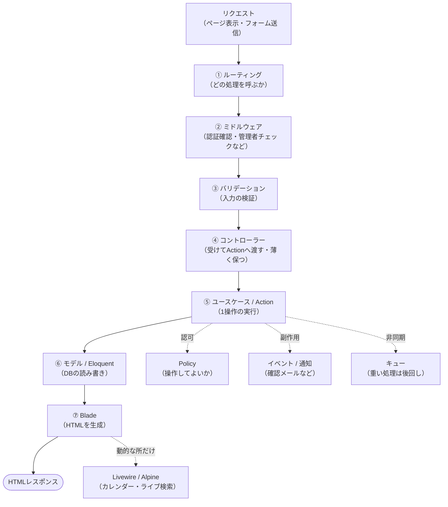
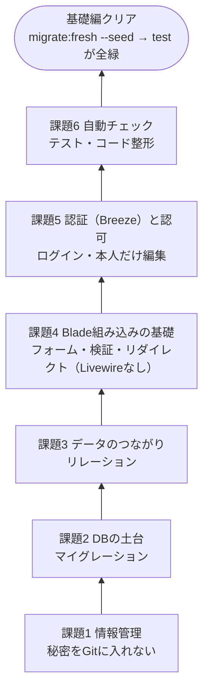
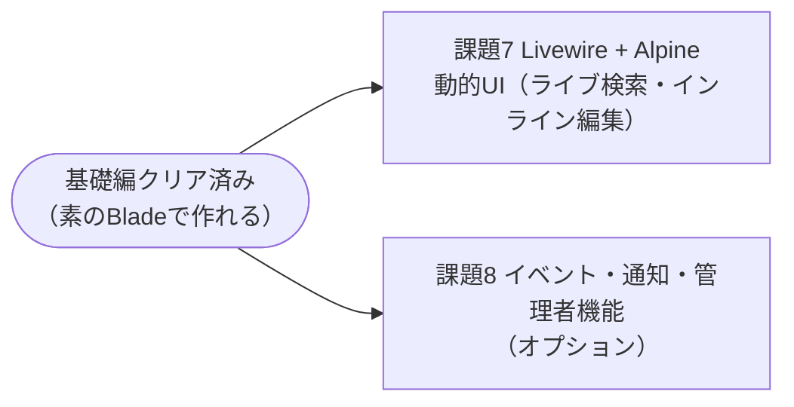
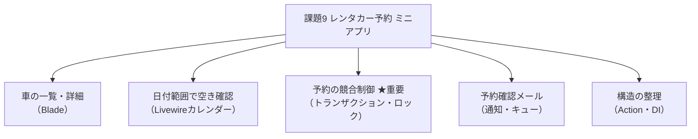

# Laravel 研修課題（3週間・平日13日・Blade組み込み路線）

現状のブログアプリを土台に、**「今のコードを正しく直す（基礎編）」→「機能を足す（応用編）」→「予約サイトのミニ版を作る（卒業課題）」** の順で進めます。**全9課題**です。

> ⏱ **期間：2026/7/7（火）〜7/24（金）の平日13日**（7/20は海の日で休）。この期間でLaravel研修を完了させます。

## この研修の狙いと路線

- **Laravelに集中**して学ぶ。画面もLaravel（Blade）で作る**「組み込み（サーバー描画）」**が中心。
- API＋React/Nextの構成は**扱いません**（画面はLaravelが生成して返す形に集中します）。
- 使う技術は **Blade ＋ 必要な所だけ Livewire/Alpine**。どちらもLaravel純正・**現在の主流（TALLスタック）**です。

### ⚠️ 学ぶ順番のルール（重要）
**まず素のBlade（Livewireなし）でひと通り作れるようにしてから、動的な所だけLivewireを足します。**
いきなりLivewireから入ると「シンプルな組み込み」が身につかないため、順番を固定します。

---

## 📍 まず全体像：リクエストが通る「1本の道」

「組み込み」では、Laravelが**画面（HTML）ごと生成して返します**。各層に役割があり、どの課題がどこを扱うか対応づけています。
（正式名称を先頭に、括弧内に役割。各課題の冒頭「🔑 この課題で学ぶLaravel用語」で調べるキーワードを確認できます。）

---

## 🧱 基礎編の地図（ブログ／既存コードを「組み込み」で直す）

現状のコードには実際に問題があります。下から順に土台を整えます。**この段階はブログが題材**です。

> **基礎編クリアの合図** ＝ まっさらな環境で `git clone → php artisan migrate:fresh --seed → php artisan test` が**全部通る**こと。

---

## 🚀 応用編の地図（ブログで機能を広げる）

---

## 🎓 卒業課題の地図（予約サイトのミニ版＝次案件の予行演習）

基礎〜応用で学んだことを統合し、**レンタカー予約のミニアプリ**を作ります。ここで**予約サイト特有の技術**を実戦練習します。

★ **予約の競合制御**（同じ車を2人が同時に予約→どう防ぐか）は、予約サイトの核心。ここが最大の学びどころです。

---

## 🗓 スケジュール（平日13日・日付ベース）

課題は「すぐ終わるもの（0.5日／1日に2つ）」と「2日かかるもの」があるため、1日単位で割り付けています。**予備日を2日（7/17・7/24）** 確保。特に7/17は**課題7の直後**に置き、早く終われば流れで課題8に入れるようにしています。

| 日付 | 割り当て | 目安 |
|------|----------|------|
| 7/7（火） | 課題1 情報管理 ＋ 課題2 スキーマ | すぐ終わる2つを同日 |
| 7/8（水） | 課題3 リレーション（N+1観測） | 1日 |
| 7/9（木） | 課題4 Blade組み込みの基礎 ①| 2日課題の1日目 |
| 7/10（金） | 課題4 Blade組み込みの基礎 ②| → **完了** |
| 7/13（月） | 課題5 認証（Breeze）＋認可（Policy） | 1日 |
| 7/14（火） | 課題6 テスト＋コード整形 → **基礎編クリア** | 1日 |
| 7/15（水） | 課題7 Livewire＋Alpine ①| 2日課題の1日目 |
| 7/16（木） | 課題7 Livewire＋Alpine ②| → **完了** |
| 7/17（金） | 🧰 **予備日①** → 終わっていれば **課題8に着手** | バッファ／課題8の入口 |
| 7/18–20（土日・海の日） | （休み。課題8を続けたい場合の余地） | 任意 |
| 7/21（火） | 課題9 予約ミニアプリ ①（設計・車/予約の土台） | 卒業課題 |
| 7/22（水） | 課題9 予約ミニアプリ ②（★競合制御・Livewireカレンダー） | 卒業課題 |
| 7/23（木） | 課題9 予約ミニアプリ ③（確認メール・仕上げ） | 卒業課題 |
| 7/24（金） | 🧰 **予備日②／最終レビュー** | バッファ |

> **課題8（イベント・通知・管理者）はオプション**。**課題7が7/16までに終われば、7/17から着手**でき、続きは土日・海の日も使えます（課題7の直後・順序どおりなので取り組みやすい配置）。予約確認メール自体は卒業課題内で最小限に触れます。
>
> ✅ 実作業11日＋予備2日。卒業課題（予約）に3日確保できており、無理のない配分です。遅れても予備日で吸収できます。

---

## 進め方のルール

1. **基礎編 → 応用編 → 卒業課題** の順。飛ばさない。
2. 1課題ごとにブランチを切り、Pull Request で提出する。
3. 各課題に **「なぜこの作り方にしたか」を150字ほど** で必ず書く（丸写しだとここで詰まる）。
4. レビューでは「動くか」だけでなく **「なぜそう書いたか説明できるか」** を見る。

## AI（ChatGPT等）の利用ルール

| 区分 | AI利用 | ねらい |
|------|--------|--------|
| 課題 1・2・6・8 | **使ってよい** | ただし採用した作りをPRで自分の言葉で説明できること |
| 課題 3・4・5・7・9 | **禁止・自力** | 組み込み・認可・Livewire・予約の要。理解度を測る |

---

## 課題一覧

### 基礎編 — ブログ／今のコードを「組み込み」で正しく直す
- [課題1 情報管理（秘密をGitに入れない）](01_基礎編/課題1_リポジトリ衛生.md)
- [課題2 命名とDBの土台づくり](01_基礎編/課題2_命名とスキーマ正常化.md)
- [課題3 データ同士のつながり（リレーション）](01_基礎編/課題3_Eloquentリレーション.md)
- [課題4 Blade組み込みの基礎（フォーム・検証・リダイレクト）](01_基礎編/課題4_Blade組み込みの基礎.md)
- [課題5 認証（Breeze）と認可（Policy）](01_基礎編/課題5_認証と認可.md)
- [課題6 自動チェック（テスト）とコード整形](01_基礎編/課題6_テストとコード規約.md)

### 応用編 — ブログで機能を広げる
- [課題7 Livewire + Alpine（動的UI）](02_応用編/課題7_Livewire.md)
- [課題8 イベント・通知・管理者機能](02_応用編/課題8_イベントと管理者機能.md) 🔸**オプション**（予備日が余れば）

### 卒業課題 — 予約サイトのミニ版（次案件の予行演習）
- [課題9 レンタカー予約ミニアプリ](03_卒業課題/課題9_予約サイト実装.md)

---

## この研修が目指す「作り方」の方針

本格DDDは**やりません**。目標は **御社の実プロジェクト（リトルダビンチ・vote）で実際に使われている型**です。
進め方は **「標準のLaravelを土台に、その型を乗せる」** のが最短。基礎編で標準を固め、卒業課題で御社の型に仕上げます。

| | 標準の素のLaravel | 御社の型＝この研修の目標 |
|---|---|---|
| データの扱い | Eloquentそのまま | **Eloquentそのまま**（本格DDDのような専用設計はしない） |
| 1つの仕事 | コントローラーに書きがち | **1操作＝1クラスの UseCase/Action**（`StoreAction` 等・`__invoke`） |
| Service | 何でも入れがち | **横断・外部連携（メール等）に限定** |
| フォルダ | 種類で分けるだけ | **`app/UseCases/{機能}/` に整理**（種類→機能サブフォルダ） |
| Repository | なし | **判断制**（voteは使用・リトルダビンチは不使用。理由を書く） |
| 画面 | — | **Blade中心、動的な所だけLivewire** |

> 基礎編は既存の `BlogService`（Service型）をそのまま使って**標準を固め**、**卒業課題で御社の UseCase/Action 型に乗せ替え**ます。
> 「使っていない仕組みを無理に入れない（＝作りすぎない）」ことも評価します。

---

## 発展：この研修の先に学ぶとよいこと

本研修は「Blade組み込み＋予約サイト」に絞っています。ここでは扱いませんが、実務で余裕が出たら以下も学ぶと幅が広がります（必須ではありません）。

- **検索の作り込み** … クエリスコープ、PostgreSQL全文検索とインデックス（性能面）
- **画像・ファイルのアップロード** … Storage、公開/非公開ディスク、サムネイル生成
- **キャッシュ／タスクスケジューリング** … Redisキャッシュ、cronでの定期実行
- **API連携が必要になったら** … API Resource、Sanctumトークン認証、Inertia（Reactを活かす選択肢）
